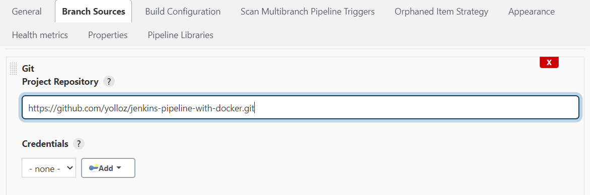

# Jenkins Pipeline Demo

This project is a fork of an existing tutorial for creating a Jenkins Pipeline for a Demo Project. I've updated some parts that were already outdated.

## Requirements:

Docker for Mac, Windows, or Linux

## Setup Docker Containers
To begin with the tutorial, clone the repository from Github “https://github.com/yolloz/jenkins-pipeline-with-docker.git” .

git clone https://github.com/yolloz/jenkins-pipeline-with-docker.git
Navigate to the directory “jenkins-pipeline-with-docker” and run the below docker command to setup Jenkins, Sonarqube and Tomcat containers.

```docker compose up -d```

To view all the running containers run the below command

```docker ps -a```

Expected output:
```
CONTAINER ID   IMAGE                 COMMAND                  CREATED          STATUS          PORTS                               NAMES
924545b44c35   jenkins/jenkins:lts   "/sbin/tini -- /usr/…"   27 seconds ago   Up 21 seconds   0.0.0.0:8080->8080/tcp, 50000/tcp   jenkins-demo-jenkins-1
79230fa4edd5   sonarqube             "/opt/sonarqube/bin/…"   27 seconds ago   Up 21 seconds   0.0.0.0:9000->9000/tcp              jenkins-demo-sonarqube-1
64c301374856   tutum/tomcat:8.0      "/run.sh"                27 seconds ago   Up 23 seconds   0.0.0.0:10000->8080/tcp             jenkins-demo-tomcat-1
```

## Configure the “Jenkins” instance

1. Navigate to the below URL to connect to your Jenkins instance.
http://localhost:8080
You should see similar screen if you are connecting first time to the Jenkins instance.


2. Connect to the Jenkins container to get the initial admin password.

```
docker exec --user root jenkins-demo-jenkins-1 cat /var/jenkins_home/secrets/initialAdminPassword
```

3. Install Maven on the jenkins container using below commands. We will be using maven to build the project in the demo. Apache Maven is a software project management and comprehension tool. Based on the concept of a project object model (POM), Maven can manage a project’s build, reporting and documentation from a central piece of information.
```
docker exec --user root jenkins-demo-jenkins-1 apt-get update
docker exec --user root jenkins-demo-jenkins-1 apt-get -y install maven
```
4. Install Jenkins suggested plugins.


5. Create the Admin user. Save and finish.


6. Go to Manage Jenkins → Manage plugins and Install the plugins “Deploy to container” and  “Copy Artifact Plugin” from the “Available” which are required for the demo. These plugins are used to copy the artifacts from the upstream job and deploy to the Tomcat server.


7. Add label “jenkins” on the built-in server.  Go to Manage Jenkins → Manage Nodes and configure the built-in node. We add the label as we restrict the stages to run on the agents with the label “jenkins” in the JenkinsFile.


## Setup Jenkins Project

1. Go to Jenkins and click on “New item”. Enter the job name as  “GameofLife_pipeline”. Select the “Multibranch Pipeline” as the Project type and click on “OK”.


2. Under Branch Sources, configure the Git repository. We will be using the repo “jenkins-pipeline-with-docker” which has already been created for the demo.  Select “GIT” from the dropdown and enter the project repository as https://github.com/yolloz/jenkins-pipeline-with-docker.git . 



3. Navigate to Jenkins and click on “New item” and create a job called “Tomcat deploy to Integration”.  Select the “Freestyle project” as the item type and click on “OK”. This is the Jenkins job to deploy the built artifact on the tomcat container. Please make sure the name of the job matches the one mentioned in the JenkinsFile. JenkinsFile is located in the repo https://github.com/yolloz/jenkins-pipeline-with-docker.git . 


4. Configure the General section and select “This build is parameterized” and add the variable as below. Select “String Parameter” as the parameter type and enter the name of the parameter as “BRANCH_NAME” and the default value as develop. We specify the  variable to copy the artifact from the correct branch.


5. Configure the build step of the project to copy the artifact from the upstream project. Enter the name of the artifact to be copied as “gameoflife-web/target/gameoflife.war“


6. Add the post-build step tp deploy to the Tomcat container and save the changes. Add the admin credentials (login: admin, password: admin) for Tomcat and select it from the dropdown. Enter the context path and the Tomcat URL as “http://tomcat:8080” 


7. After these jobs are created, you should see a build running on the master branch. If the build is not started automatically, you can manually click “Scan multipbranch pipeline Now”. We have configured the jenkins job to scan the  repository every 2 minutes in the tutorial. We can also setup webhooks in Github instead of polling the Git repository. 


## View Build Results

Once the build is completed, you can navigate to the URL “http://localhost:9000” to view the sonar scan results and browse the application using the URL: http://localhost:10000/gameoflife/

In Jenkins, Stage View provides extended visualization of Pipeline build history on the index page of a flow project . This represents the stages which are configured in the Jenkins Pipeline.

## Overview of Jenkins Pipeline

In the current pipeline demo, we have use  the “Game of life” maven project. We configured three stages as below. Additional stages can be created by updating the “Jenkinsfile”.
```
pipeline {
agent none
stages {
 stage('Build and Test') {
   agent {node{
   label "jenkins"}
         }

   steps {
   sh 'mvn clean package'
   sh 'echo "build ran"'
   archiveArtifacts artifacts: 'gameoflife-web/target/gameoflife.war', fingerprint:true
   junit '**/target/surefire-reports/*.xml'

        }
}
 stage ('Sonar Analysis') {
   agent {node{
   label "jenkins"}
         }

   steps {
   sh 'echo "running sonar analysis"'
   sh "mvn sonar:sonar -Dsonar.host.url=http://sonarqube:9000 -Dsonar.branch=${env.BRANCH_NAME}"
         }
}
 stage ('Deploy to Integration') {
   agent {node{
   label "jenkins"}
         }
   steps {
   build job:'../Tomcat deploy to Integration' , parameters:[string(name: 'BRANCH_NAME', value: "${env.BRANCH_NAME}")]
         }
}
        }
}
```
### Stage 1 : Build and test the artifact.
In this stage, we use maven commands to build and test the artifact.

```mvn clean package```

### Stage 2 : Run sonar analysis 

In this stage we will run the code analysis , the scan results will be then displayed in SonarQube. We will pass the Sonar host URL and Sonar branch as parameters,

```mvn sonar:sonar```

### Stage 3 : Deploy to Integration.

In this stage, we execute the  job “Tomcat deploy to Integration” configured which uses the plugin to copy the artifact from the upstream job and deploy it to the Tomcat container. 

## Conclusion:
By the end of this tutorial you should have a demo enviroment setup for automated deployment using Jenkins Pipeline. Last part gives a quick overview of the Jenkinsfile used in the demo.